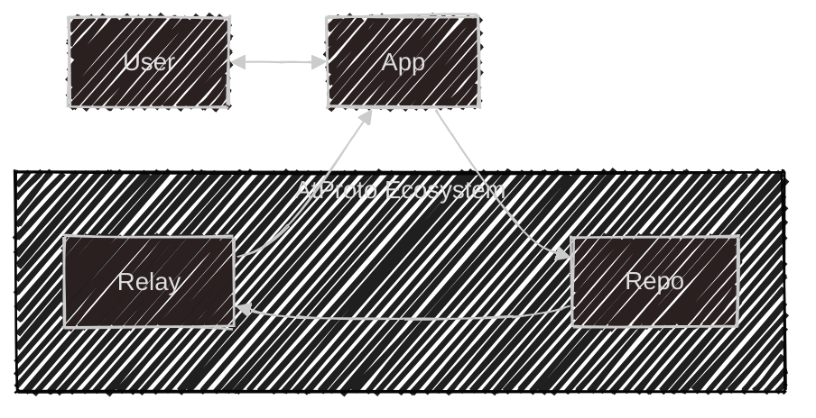
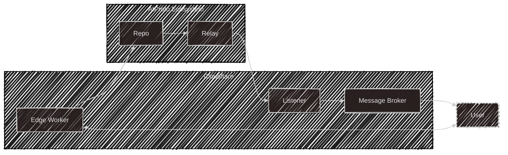

# Statusphere Rust CF

Statusphere is a very simple app that does one thing: publish emojis as a snapshot of how a user's feeling.

It's commonly used to demonstrate minimum viable working atmosphere applications, so when we use it we'll be joining a greater community of developers and hackers (all of whom are publishing status updates about how they feel like :rocket ship: emoji, or perhaps :brain emoji:).

# Why Cloudflare?

The traditional Statusphere implementation uses a node server to handle HTTP requests, manage a long-running firehose listener, and perform database updates. It's an amazing demo of what atproto can do, but actually deploying it requires setting up an ec2 instance, managing database state, and a bunch of other things you don't really want to do if you can avoid it. 

In this blog post I show how to split Statusphere up into serverless components, all of which can be run on Cloudflare's free plan.

## The Atmosphere: a high level view

Let's start with a model of how data flows in the atmosphere

glossary: https://atproto.com/guides/glossary

## App

Apps are what users interact with. Bluesky is an app.

### Repos

Repos are managed by Personal Data Servers, or PDS. They store user's data and signing keys, and manage read/write operations and authentication.

## Relay

Repos publish events to Relays, which aggregate event streams into a firehose

## And back to Apps

Apps then read events from the firehose. 

# Serverless Atmosphere

Here's a sketch:

Here's how it works: 

Users authenticate with the edge worker, which handles session authentication and interacting with user's repos. It also handles establishing a websocket connection between the user and the Message Broker, a durable object used to handle push updates.

The listener (another durable object) wakes at regular intervals and reads the stream of events that occured since it last woke. These events are forwarded to the message broker, which sends them on to each active user via websocket.

## Optimistic Updates

When we publish a status, we don't want to wait for it to loop all the way from repo to relay and back to our listener. Instead, we write the status to a distributed D1 database and immediately send it to the message broker. This lets users see the results of their actions instantly. It also gives us an easy way to read the last 10 status update events to display when a user loads the app's home page. When we see a status via the firehose, we write to the database to note that the event has been published globally.

## Live events

Waking up every minute and reading the last minute's events is ok for a prototype, but we can do better. I'll be updating this post later to show how to use cloudflare queues to do so.

## References

This post builds on
- statusphere by bsky team
- rusty statusphere
Both of these posts are extremely good and I recommend reading them. They provide a much fuller picture of how things work in the ATProto ecosystem.

<!-- This repo shows how to build a serverless atproto application hosted on Cloudflare's globally distributed platform. This README file is a sketch, and will be updated in the coming days (and eventually, turned into a blog post). -->